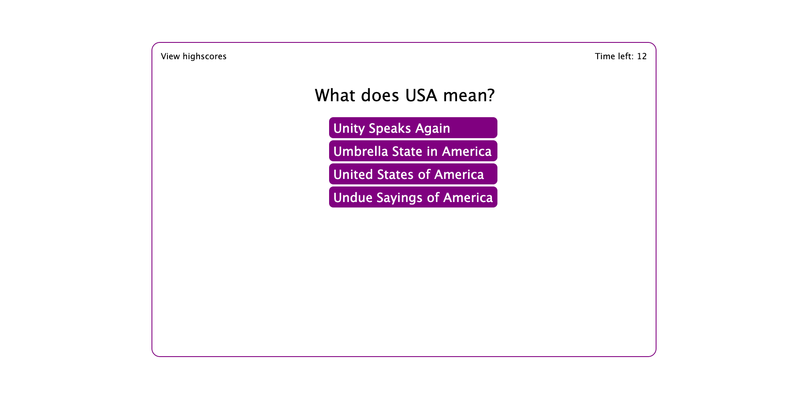

# Timed-Quiz
## Description
A timed quiz with multiple choice answers, a timer and stores high score.

Below is how the application works:
* When a user clicks the start button, a timer starts and he is presented with a question
* When he answers a question, he is presented with another question
* When he answers a question incorrectly, 10 seconds is deducted from the clock
* when all questions are answered or timer reaches zero, game is over
* when game is over, user can save his initials and score

## Installation
The URL of the deployed application is: https://buky-js.github.io/Timed-Quiz/

You URL of the GitHub repository containing the code is: https://github.com/Buky-js/Timed-Quiz

## Usage
You can find the code to the application in my Github account

## Credits
N/A

## License
Please refer to MIT license used in the repo
